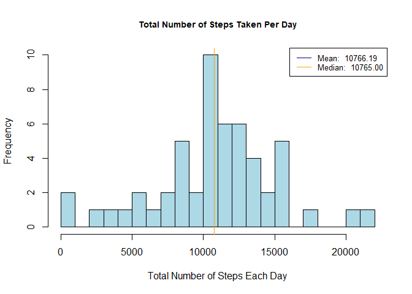
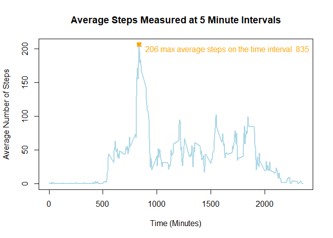
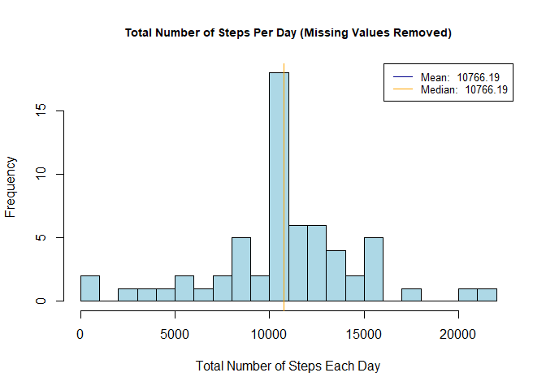
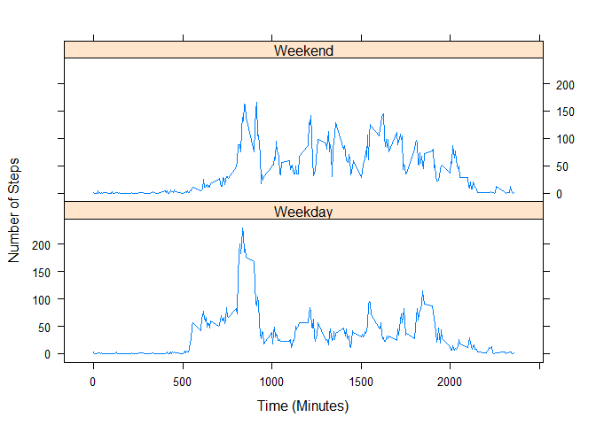

** This document contanis the response to Peer Assessment 1 assignment for the Reproducible Research class in the Data Science Specialization by John Hopkins University. The instructions for this assignment can be found [here](https://github.com/rdpeng/RepData_PeerAssessment1). The dataset used for this project and its description may also be found on there. **

***

## Loading and preprocessing the data


I first set up the environment and list necessary libraries. Make sure the script is run in the correct working directory (the folder should be RepData_PeerAssessment1).


```r
rm(list = ls(all=TRUE))

library(utils)
library(data.table)
library(dplyr)
library(lattice)
```

Then, unzip the data (as needed) and load it into R:

```r
zipfile <- "activity.zip"
activityfile <- "activity.csv"

# Unzip data as needed
if (!file.exists(activityfile)) {
  temp <- tempfile()
  temp <- zipfile
  unzip(temp)
}

activity = read.csv(activityfile)

# use data.table for easy reading
# activity_tbl = data.table(activity)
```

To inspect the data, I use the following:

```r
# Examine given dataset
names(activity)
```

```
## [1] "steps"    "date"     "interval"
```

```r
str(activity)
```

```
## 'data.frame':	17568 obs. of  3 variables:
##  $ steps   : int  NA NA NA NA NA NA NA NA NA NA ...
##  $ date    : Factor w/ 61 levels "2012-10-01","2012-10-02",..: 1 1 1 1 1 1 1 1 1 1 ...
##  $ interval: int  0 5 10 15 20 25 30 35 40 45 ...
```

```r
head(activity)
```

```
##   steps       date interval
## 1    NA 2012-10-01        0
## 2    NA 2012-10-01        5
## 3    NA 2012-10-01       10
## 4    NA 2012-10-01       15
## 5    NA 2012-10-01       20
## 6    NA 2012-10-01       25
```

Per the course website, the dataset is downloaded in a zip file containing a single csv file with the specifications below. So we are looking at the right dataset.

> * steps: Number of steps taking in a 5-minute interval (missing values are coded as NA)
* date: The date on which the measurement was taken in YYYY-MM-DD format
* interval: Identifier for the 5-minute interval in which measurement was taken
The dataset is stored in a comma-separated-value (CSV) file and there are a total of 17,568 observations in this dataset.

***

## Histograms with Summary Statistics

A histogram can easily illustrate frequency of a measurement, or how often a value is produced. We can also use this graph to draw summary statistics, such as mean, median, or mode. Below, I have a function to generate a histogram scaled to our dataset. This will be called multiple times for the questions below.


```r
hist_mm <- function(data, title, showsumstats=TRUE) {
  
  # Generate the histogram
  hist(  data
       , breaks = 20
       , main = title
       , xlab = 'Total Number of Steps Each Day'
       , col = 'lightblue'
       , cex.main = 0.9)
  
  # If mean and median is desired,
  # calculate summary statistics, rounding to two decimal places
  if (showsumstats) {
  mean_value = round(mean(data),2)
  median_value = round(median(data),2)
  
  # Draw lines and include legend
  abline(v = mean_value, lwd = 1, col='darkblue')
  abline(v = median_value, lwd = 1, col='orange')
  
  legend(  'topright'
         , lty=1
         , lwd=1
         , col = c('darkblue', 'orange')
         , cex = 0.8
         , legend = c(  paste('Mean: ', format(mean_value, nsmall=2))
                      , paste('Median: ', format(median_value, nsmall=2)))
  )
  }
}
```

***

## What is mean total number of steps taken per day?

For this part of the assignment, I ignore missing values and summarize the data by taking the sum of the step entries per day. Using this information, I provide a histogram showing the mean and median total number of steps per day.


```r
# Summarise data by day

sumbyday <- 
  activity %>%
  filter(!is.na(steps)) %>%
  group_by(date) %>%
  summarise(totalsteps = sum(steps, na.rm=TRUE))

# Call histogram function on total steps

hist_mm(sumbyday$totalsteps, 'Total Number of Steps Taken Per Day')
```

<!-- -->

The legend above provides mean and median values of steps taken per day.  
The mean total steps per day is 1.0766189\times 10^{4}. The median total steps per day is 10765.

***

## What is the average daily activity pattern?

Time series plots are useful in visualizing measurements over time. In this case, we use time series to visualize steps taken in each discrete interval of time (5 minute intervals). The time axis, in minutes, is on the x-axis, and the number of steps in a given interval is on the y-axis.  
To address the average daily activity pattern and the 5-minute interval that has the maximum number of steps per day, I first summarize the dataset by interval.


```r
# Summarise data by interval

sumbyinterval <- 
  activity %>%
  filter(!is.na(steps)) %>%
  group_by(interval) %>%
  summarise(avgsteps = mean(steps, na.rm=TRUE))

# Find the corresponding interval and max(avgsteps)

maxsteps <-
  sumbyinterval %>%
  filter(avgsteps == max(avgsteps))

# Plot the time series
with( sumbyinterval, {
        plot(interval, avgsteps
             , type = 'l'
             , main = 'Average Steps Measured at 5 Minute Intervals',
             , xlab = 'Time (Minutes)'
             , ylab = 'Average Number of Steps'
             , col = 'lightblue'
             , lwd = 2
             )
        })

# Coordinates of max interval
points(maxsteps$interval, maxsteps$avgsteps
       , col = 'orange'
       , lwd = 3
       , pch = 13
       )

# legend
legend('topright'
       , legend = paste(round(maxsteps$avgsteps,0), 'max average steps on the time interval ', maxsteps$interval)
       , text.col = 'orange'
       , bty = 'n')
```

<!-- -->

***

## Imputing missing values

In this section, I address each prompt individually:

>1. Calculate and report the total number of missing values in the dataset (i.e. the total number of rows with NAs)


```r
sum(is.na(activity$steps))
```

```
## [1] 2304
```

>2. Devise a strategy for filling in all of the missing values in the dataset. The strategy does not need to be sophisticated. For example, you could use the mean/median for that day, or the mean for that 5-minute interval, etc.

A simple method to do this would be to use **sumbyinterval** to impute missing values by matching intervals with an NA value with that interval's average.

>3. Create a new dataset that is equal to the original dataset but with the missing data filled in.


```r
# join sumbyinterval with activity table
activityjoined <-
  activity %>%
  left_join(sumbyinterval, by="interval")

# use mapply to replace NA values in steps with avgsteps
NA_replace <- function(x,y) {
  if(is.na(x)){
    return(y)
    }
  return(x)
}

activityimputed <- data.table(activityjoined)
activityimputed$stepsimputed = mapply(NA_replace, activityimputed$steps, activityimputed$avgsteps)

# summarize new dataset by day

activityimputed_byday <- 
  activityimputed %>%
  group_by(date) %>%
  summarise(totalsteps = sum(stepsimputed))
```

>4. Make a histogram of the total number of steps taken each day and Calculate and report the mean and median total number of steps taken per day. Do these values differ from the estimates from the first part of the assignment? What is the impact of imputing missing data on the estimates of the total daily number of steps?


```r
hist_mm(activityimputed_byday$totalsteps, 'Total Number of Steps Per Day (Missing Values Removed)')
```

<!-- -->

By filling in NA values with average values, we have reinforced the mean. The mean is identical to the median. The mean total steps per day is 1.0766189\times 10^{4}. The median total steps per day is 1.0766189\times 10^{4}.

Summary Statistic | Without NA Values | With NA Values Imputed from Interval Averages
------------------| ----------------- | ----------------------
Mean | 10766.19 | 10766.19 
Median | 10765 | 10766.19
Standard Deviation | 4269.18 | 3974.391

As per the above table, using this imputation method, the mean total steps per day does not change significantly. However, the median comes closer to the mean when using this imputation method. Of note, the standard deviation decreases due to more values closer to the mean value.

***

## Are there differences in activity patterns between weekdays and weekends?

In this section, I address each prompt below. I use the dataset with the filled-in missing values for this part.

>1. Create a new factor variable in the dataset with two levels -- "weekday" and "weekend" indicating whether a given date is a weekday or weekend day.


```r
# Factor labeller
weekpart <- function(x) {
  if(x %in% c('Saturday','Sunday')){
    return('Weekend')
  }
  return('Weekday')
}

# Use weekdays() to get day name in activityimputed_byday
activityimputed$dayname = weekdays(as.Date(activityimputed$date))

# Use factor labeller to discriminate weekday and weekend
activityimputed$daytype = as.factor(apply(as.matrix(activityimputed$dayname),1,weekpart))

# Prepare dataset for time series plot
impbyinterval <-
  activityimputed %>%
  group_by(interval, daytype) %>%
  summarise(avgsteps = mean(stepsimputed))
```

>2. Make a panel plot containing a time series plot (i.e. type = "l") of the 5-minute interval (x-axis) and the average number of steps taken, averaged across all weekday days or weekend days (y-axis). The plot should look something like the following, which was created using simulated data:


```r
xyplot(avgsteps ~ interval | daytype
       , data = impbyinterval
       , type = 'l'
       , xlab = 'Time (Minutes)'
       , ylab = 'Number of Steps'
       , layout = c(1,2)
)
```

<!-- -->

Yes there are some differences between weekend data and weekday data. Weekend activity seems to be more constant throughout the day, while during weekdays, there is a spike of activity between 500-1000 intervals.
